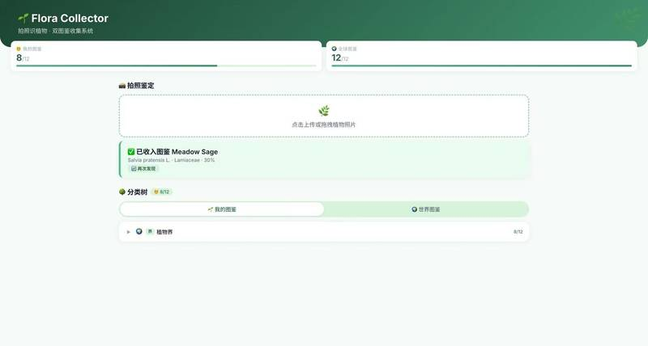
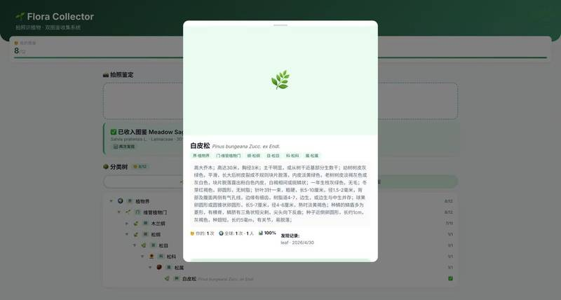

# 🌿 Flora Collector · 植物图鉴

> 拍照识花 + 自动补中文资料 + 双图鉴系统

拍张照片自动识别物种，优先从 **iPlant 中国植物志** 拿中文名 + 描述 + 完整分类链，覆盖 PlantNet 的学名分类数据。个人图鉴 + 全球图鉴双轨制，完整分类树（界门纲目科属种）逐层展开。

<div align="center">
  
  <br>
  <em>🌳 分类树浏览 — 逐层展开，实时显示已发现/总数</em>
</div>

<br>

<div align="center">
  
  <br>
  <em>🔍 物种详情 — 照片、中文名、学名、完整分类链、描述</em>
</div>

---

## 📖 图鉴系统详解

Flora Collector 的核心是**双图鉴系统**，包含两套相互关联的收集进度：

### 👤 个人图鉴（Personal Encyclopedia）

每当你上传一张照片并成功识别，该物种就会被记录到你的个人图鉴中。

- **从零收集** — 每个新用户从 0 种开始，逐步积累
- **发现计数** — 每个分类节点（界门纲目科属）都显示你的已发现数 / 全球已开图鉴数
- **多用户隔离** — 小明和小红各有独立的收集进度，互不干扰
- **首次发现标记** — 自动记录每个人的首次发现时间

### 🌐 全球图鉴（Global Encyclopedia）

所有用户共享一个物种总库，记录整个系统总共收录了多少物种。

- **物种总量** — 反映数据库全局收录的物种数
- **共同增长** — 任何用户识别新物种，全球图鉴同步更新
- **完整覆盖** — 已收录物种别人无需重复识别

### 🌳 分类树（Taxonomy Tree）

所有分类按 **界 → 门 → 纲 → 目 → 科 → 属 → 种** 七级展开，以树形结构展示：

**个人视角：**
```
植物界  →  已发现 5/7
├── 被子植物门  →  4/5
│   ├── 木兰纲  →  2/2
│   │   ├── 蔷薇目  →  1/1
│   │   │   ├── 蔷薇科  →  1/1
│   │   │   │   ├── 蔷薇属  →  1/1
│   │   │   │   │   ├── ✅ 月季 (Rosa chinensis)
│   │   │   │   │   └── 🔒 ???
│   │   └── 樟目  →  1/1
│   └── 百合纲  →  2/3
├── 裸子植物门  →  1/2
└── ...（更多分支）
```

- ✅ **已发现物种** — 植物名可见，点击查看详情
- 🔒 **未发现物种** — 名字隐藏，只显示未知数量，保持探索乐趣
- 📊 **实时统计** — 每个节点右侧显示「已发现/全球已开」，一目了然

---

## ✨ 已实现功能

| 功能 | 说明 | 状态 |
|------|------|:----:|
| 📸 **PlantNet 真识别** | 接入 PlantNet API 真实识别，2 万+ 物种 | ✅ |
| 🌱 **iPlant 中文数据** | 优先从中国植物志获取中文名+描述+完整分类，AJAX API 直调，免 Playwright | ✅ |
| 🌳 **完整分类树** | 界→门→纲→目→科→属→种 逐层树形展开，显示已发现/总数 | ✅ |
| 🔒 **未发现隐藏** | 未解锁物种名隐藏，显示 `🔒 ???` | ✅ |
| 👤 **双图鉴系统** | 个人图鉴（从零收集）+ 全球图鉴（共享增长） | ✅ |
| 👥 **多用户支持** | 小明/小红独立收集进度，使用 localStorage 区分身份 | ✅ |
| 🖼️ **图片压缩** | 上传时自动压缩至 1200px，节省带宽和存储 | ✅ |
| 🔄 **分类覆盖策略** | iPlant 分类 > PlantNet 分类 > 属→纲/门兜底映射表 | ✅ |
| 🖱️ **响应式前端** | 纯 HTML/CSS/JS，手机电脑均可 | ✅ |
| 🛠️ **启动自愈** | 服务启动时自动补爬所有缺描述的物种 | ✅ |
| 📂 **分类库归档** | 一次性迁移脚本移至 `scripts/archive/`，保持项目整洁 | ✅ |

## 🚀 快速开始

```bash
# 1. 进入项目
cd ~/projects/flora-collector

# 2. 激活环境
source .venv/bin/activate

# 3. 安装依赖
pip install -r requirements.txt

# 4. 配置 PlantNet API Key
export PLANTNET_API_KEY="your_key_here"
# 申请：https://my.plantnet.org/

# 5. 启动
uvicorn src.flora_collector.main:app --host 0.0.0.0 --port 8899 --reload
```

浏览器打开 **http://localhost:8899** 即可。手机同 WiFi 用局域网 IP 访问。

## 🔄 识别流程

```
用户上传照片
    ↓
图片自动压缩（1200px宽度，70%质量）
    ↓
PlantNet API 识别 → 返回物种学名 + 部分分类
    ↓
[新物种判断] → 已收录？→ 直接记录收集
                ↓（未收录）
iPlant AJAX API（plantinfo.ashx + getspinfos.ashx）
    → 中文名 ✅ + 完整描述 ✅
    → iPlant 分类（注意：被子植物的 "Angiospermae" 不是正式门，
      跳过，由 fallback 填维管植物门）
    → 覆盖 PlantNet 的分类数据（iPlant 更权威）
    ↓
创建分类链（界门纲目科属）→ 写入 Species + 双图鉴
    ↓
返回前端展示
```

**数据源变更历史：**
- ~~Playwright 无头浏览器爬 iPlant~~ → iPlant AJAX API 直调（0.2s/种，稳定可靠）
- ~~iPlant "Angiospermae" 被误认为"门"~~ → 识别并跳过，自动 fallback 到维管植物门

## 📊 API 端点

| 方法 | 路径 | 说明 |
|------|------|------|
| `GET` | `/api/health` | 健康检查 |
| `POST` | `/api/identify` | 上传图片识别（multipart: `image` + `organ`） |
| `GET` | `/api/encyclopedia/user` | 个人图鉴统计 |
| `GET` | `/api/encyclopedia/global` | 全球图鉴统计 |
| `GET` | `/api/encyclopedia/species/{id}` | 物种详情（分类链/描述/收集记录） |
| `GET` | `/api/taxonomy/tree` | 完整分类树（scope=world\|user） |
| `POST` | `/api/seed/inaturalist/{taxon_id}` | 从 iNaturalist 导入新物种 |
| `GET` | `/api/search/inaturalist?q=` | 搜索 iNaturalist 物种 |

> **iNaturalist** 是一个全球自然观察社区平台，这里的端点提供手动补充 PlantNet 识别不出的物种，通常作为备用数据源使用。

## 🗄️ 项目结构

```
flora-collector/
├── src/flora_collector/
│   ├── main.py                  # FastAPI 入口 + 启动自愈
│   ├── config.py                # 配置（数据库 URL、API Key 从 .env 读取）
│   ├── models.py                # SQLAlchemy 模型（6 分类表 + 双图鉴）
│   ├── api/
│   │   └── routes.py            # API 路由（8 个端点）
│   ├── services/
│   │   ├── encyclopedia.py      # 📖 双图鉴核心：record_discovery + 统计 + 详情
│   │   ├── iplant.py            # iPlant AJAX API 客户端（中文名+描述+分类）
│   │   ├── plantnet.py          # PlantNet API 客户端 + taxonomy 构建
│   │   ├── mock_plantnet.py     # PlantNet Mock（开发/离线测试用）
│   │   ├── taxonomy.py          # 分类链创建 + 分类树构建（递归）
│   │   ├── taxonomy_map.py      # 分类映射表（科→目、中文名、属→纲/门兜底）
│   │   └── inaturalist.py       # iNaturalist API 客户端（手动搜索/导入）
│   └── static/
│       └── index.html           # 🌟 树形图鉴前端（纯 HTML/CSS/JS）
├── assets/
│   └── screenshots/             # 界面截图
│       ├── encyclopedia-tree.jpg
│       └── encyclopedia-detail.jpg
├── scripts/
│   ├── build_full_taxonomy.py   # 完整植物分类骨架构建（9 门 × 多纲 × 多目）
│   └── archive/                 # 一次性迁移脚本归档
│       ├── migrate_taxonomy.py
│       ├── fix_unplaced.py
│       ├── seed_taxonomy_skeleton.py
│       └── ...（其他旧脚本）
├── .env                         # 🔒 API Key（不上传）
├── .gitignore
├── LICENSE
└── README.md
```

## 🌱 数据源策略

| 数据源 | 用途 | 优先级 |
|--------|------|:------:|
| **iPlant 中国植物志** | 中文名 + 描述 + 完整分类（含中文目科属） | ⭐ 最高 |
| **→ 特殊处理** | iPlant 对被子植物插入非正式层级 "Angiospermae"，跳过，下游 fallback 补 | — |
| **PlantNet API** | 物种识别（学名匹配） | 识别唯一入口 |
| **PlantNet 返回分类** | 纲/目/科/属的拉丁名 | 被 iPlant 覆盖 |
| **属→纲/门映射表** | 兜底（当上述两者都缺失时） | 兜底 |

### iPlant 分类数据注意点

iPlant 的 `classsys` 使用从低到高的字符串分级：
- **裸子植物**（银杏、松柏）：7 级 = 种→属→科→目→纲→**门**→界 ✅
- **被子植物**（月季、玉簪）：7 级 = 种→属→科→目→纲→**Angiospermae**→界

被子植物的 `Angiospermae` 是界和纲之间的**非正式占位符**，不是"门"。所有被子植物都属于**维管植物门 (Tracheophyta)**，由兜底映射自动补充。

## 🛠️ 技术栈

| 层 | 技术 |
|----|------|
| 后端 | Python 3.12, FastAPI, SQLAlchemy, aiosqlite |
| 前端 | 纯 HTML + CSS + Vanilla JS（无构建工具） |
| 识别 | PlantNet REST API（真实识别） |
| 中文数据 | iPlant 内部 AJAX API（免 Playwright，~0.2s/种） |
| 兜底 | 属→纲/门映射表 |
| 数据库 | SQLite |

## 📜 License

MIT
